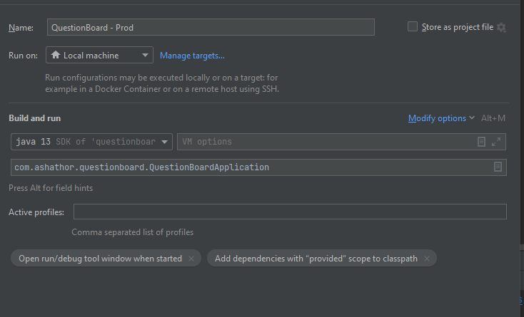
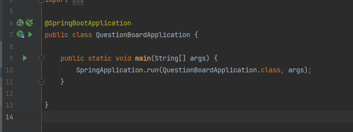

# QuestionBoard
SDLC Assessment application

To use goto https://sdlcquestionboard.herokuapp.com/ - the first load will take time as the application will need to be
woken up from sleep mode.

To access the Q&A board you will need to log in
Credentials are as follows:

user : userpassword
admin : adminpassword

^^^ Should this not work please perform the following VVV

Pre requisites - the following system environment variables must be set according to the ENV VARS.txt in the zip 

SPRING_DATASOURCE_URL

SPRING_DATASOURCE_USERNAME

SPRING_DATASOURCE_PASSWORD

This connects to the remote AWS database hosted for this application.

If you wish to run this locally, postgres installation will be required as well as a database setup and the create 
script in src/main/sql/create.sql You will also need to go into src/main/resources/application.properties and uncomment 
lines 2-4 and comment 7-9 adding your local details to lines 2-4

Open the project in Intelij.

You must have an up to date version of java. 

The following is the run configuratiuon required.

alternativly use smart start form intelij - Click on the start icon on line 9 in image

you should be good to run the application on localhost:8080/

